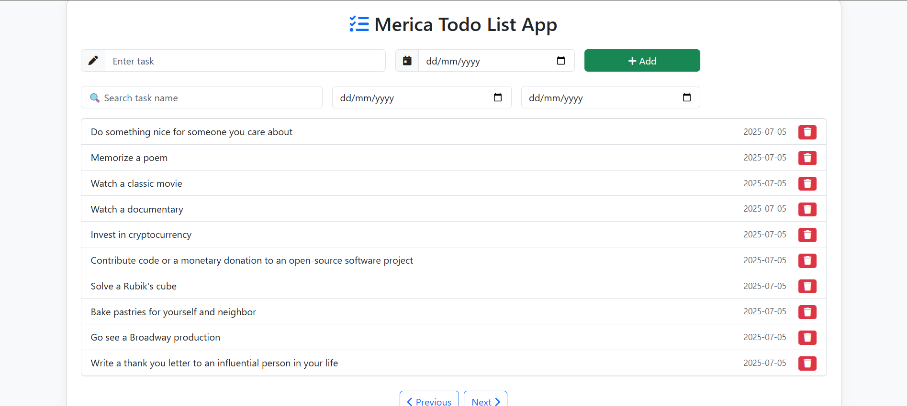

# 📝 Todo List App 

A clean and responsive Todo List application built with **HTML**, **Bootstrap**, and **JavaScript (ES6)**. It interacts with the [DummyJSON API](https://dummyjson.com) to fetch, add, and simulate delete operations for tasks.
---

## Features

- ✅ View paginated list of todos
- ✅ Add new todo (POST)
- ✅ Search by task name (local filtering)
- ✅ Filter todos by date (From – To)
- ✅ Delete todo (simulated for locally added ones)
- ✅ Loading indicator during API calls
- ✅ Error handling and user-friendly alerts
- ✅ Responsive, mobile-friendly UI using Bootstrap 5

---

##  Tech Stack

- **HTML5**
- **Bootstrap 5**
- **JavaScript (ES6)**
- **Fetch API**
- **DummyJSON API** – https://dummyjson.com

---

## 📸UI Preview

 <!-- Add screenshot.png in the repo root -->

---

##  Setup & Run Locally

1. **Clone the repository**
   ```bash
   git clone https://github.com/your-username/todo-list-app.git
   cd todo-list-app
